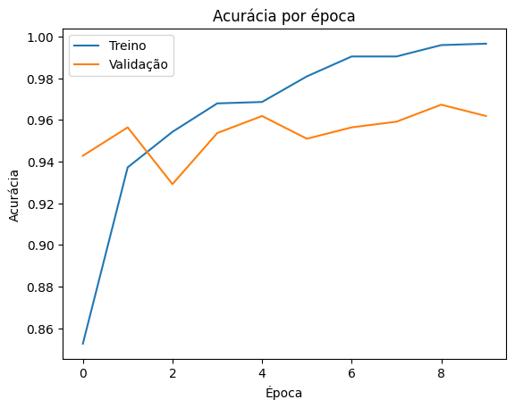
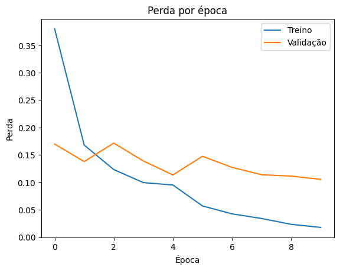
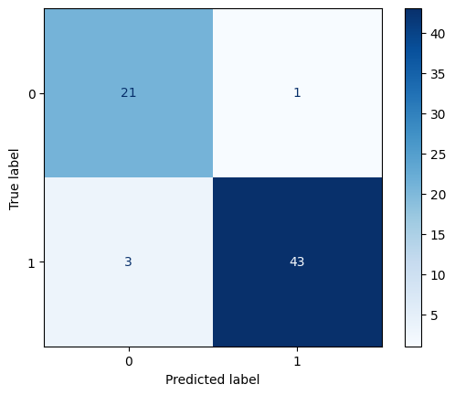
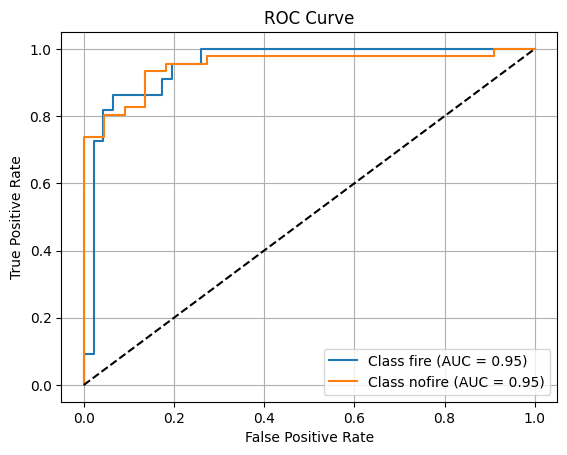

# 🚒 Classificador de Queimadas (CNN)

Projeto de classificação de imagens em duas categorias:  
- **`fire`** (queimada)  
- **`no_fire`** (não queimada)

## 🔍 Descrição

Este projeto implementa e compara três abordagens de Deep Learning para detectar queimadas em imagens:

1. **CNN treinada do zero** – arquitetura customizada e treinada em ~10 épocas.  
2. **Transfer Learning** – utilizando InceptionV3 pré-treinado no ImageNet.  
3. **Fine-Tuning** – refinamento do modelo pré-treinado em nosso conjunto de dados.

O objetivo é avaliar acurácia, generalização e custo computacional de cada abordagem.

## 📊 Resultados

## Resultados da CNN Treinada do Zero

- Acurácia (test): 94%
- Precision/Recall/F1 (classe 0): 0.88 / 0.95 / 0.91
- Precision/Recall/F1 (classe 1): 0.98 / 0.93 / 0.96

Observação: sinais claros de overfitting (train_loss→0 vs val_loss≈0.10).

### Gráficos de Acurácia e Perda

## Resultados da Transferência de Aprendizado

- Acurácia (test): 100%
- Precision/Recall/F1 (ambas classes): 1.00

Observação: excelente generalização, mas maior custo computacional.

# Interpretação do Fine-Tuning

- Acurácia (test): 100%
- Precision/Recall/F1 (ambas classes): 1.00

Observação: treinamento interrompido em 11/50 épocas via EarlyStopping.
Este documento traz a análise dos resultados obtidos após o fine-tuning do modelo de classificação de imagens de queimadas.

## 📝 Conclusões e Próximos Passos

Melhor abordagem: Transfer Learning e Fine-Tuning superaram CNN do zero em acurácia e generalização.

Overfitting (CNN do zero):

- Adicionar data augmentation
- Incluir Dropout e BatchNormalization
- Aumentar volume de dados ou usar validação cruzada

Hyperparam tuning: explorar learning_rate, batch_size e callbacks (EarlyStopping, ReduceLROnPlateau)

Escalabilidade: converter Fine-Tuning para TinyML no ESP32-CAM para inferência embarcada
